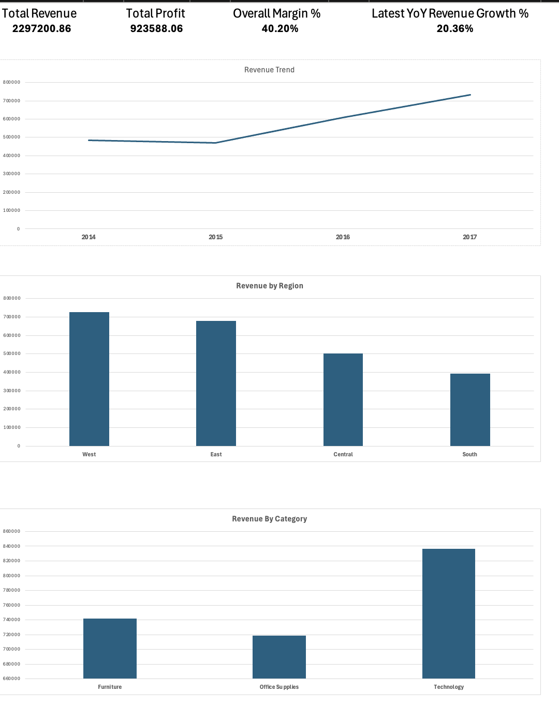

# Financial Performance Dashboard (Excel)

## Overview
This project is an end-to-end financial performance dashboard built in Microsoft Excel using a real retail sales dataset.

The objective was to analyse business health and present insights in a clean, executive-friendly format.

## Key Metrics
- Total Revenue
- Total Profit
- Overall Margin %
- Year-over-Year Revenue Growth

## Analysis Performed
- Revenue trend analysis (YoY)
- Regional performance comparison
- Product category performance analysis
- KPI calculation and dashboard linkage

## Assumptions & Modelling
A simple assumption-based cost model was created by product category to estimate profitability and margin.

## Tools & Skills
- Microsoft Excel
- Pivot Tables
- KPI Modelling
- Business Analysis
- Dashboard Design

## Project Structure
- Dashboard: Final executive dashboard
- Dashboard_Data: Chart-ready linked tables
- KPI_Calculations: Centralised KPI logic
- Assumptions_Model: Cost and margin assumptions
- Raw_Data: Original dataset

## Dataset
Retail Superstore Dataset (Kaggle)

## Screenshots

